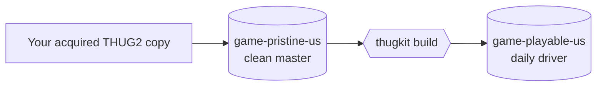

# Build pipeline

`./revert build` turns the clean pristine base into the playable, modded edition. It runs in
two parts: the Go `thugkit build` core, then a bash-side Python CAS post-pass. This page
traces the whole thing.

## The two data directories



- **`game-pristine-us/`** is the clean, unmodified master, produced by `revert acquire-game-data`
  from your own copy. The build treats it as read-only.
- **`game-playable-us/`** is the modded output: no-CD + widescreen + mods + HQ A/V, plus the
  cosmetic CAS extras.

Mods are injected into the user's **own** base `.prx` archives, so any region's base rebuilds
into a boot-safe edition.

## Part 1: the Go core (`thugkit build`)

`build/build.go:Run` executes these steps in order:

1. **Validate + prepare.** Confirm the pristine base has `Data/pre`; make the destination
   `Save/` directory.
2. **Mirror the base.** A full build copies all of `game-pristine-us/Data` plus the root
   files into `game-playable-us`. `--fast` instead only resets `Data/pre` from pristine (the
   mod target), skipping the expensive full mirror.
3. **No-CD exe.** Copy the no-CD `THUG2.exe` over, falling back to the pristine exe so the
   edition is always launchable.
4. **WidescreenFix** (`wsfix.go`, via stdlib `archive/zip`). The load-bearing step: it renames
   `dinput8.dll` to **`winmm.dll`** so Wine's native DirectInput keeps enumerating the
   controller, and drops the `scripts/*.asi` / `.ini`. The renamed `winmm.dll` is also the
   Ultimate ASI Loader that loads our custom `.asi`s.
5. **Apply the mods** (`apply.Run`). Compile each `.ns` to `.qb` in-process and inject into
   the base `.prx` archives. See [Authoring mods](modding.md) and [Codecs](codecs.md).
6. **Custom tags** (`installTags`), the **HUD-fix / glyph-fix / keyboard-grid `.asi`s**
   (`installASI`), the **HQ A/V overlay** (`overlay.go`, full build only), and the optional
   **default soundtrack** (`soundtrack.go`).

Everything here is pure Go with no shelling out. The step flags map to `revert build` options:
`--no-cd`, `--wsfix`, `--hq-audio`, `--hudfix`, `--glyphfix`, `--keyboardgrid`, `--tags`,
`--only <a,b>`, `--fast`.

## Part 2: the bash CAS post-pass

Back in `revert` (`cmd_build`), after the Go core returns:

- **`cas_post_pass`** (Python): the Create-A-Skater cosmetic layer, presence-gated on
  numpy + Pillow (optional, purely cosmetic). Recolours, the deck pack, guest/playas models,
  and stickers.
- **`install_credits_movies`**: the prebuilt credits `.bik` movies.
- **`install_vv_portrait`**: the bespoke Violet Vandal Select-Skater portrait
  (`ss_vv.img.xbx`, loaded loose).

The CAS extras are optional because they are the only part that needs Python. The core edition
boots and plays without them.

## HQ audio caveat

Before a full build, bash extracts the HQ audio pack to `.revert-cache/hq-audio`, **excluding
`pcm.wad` / `pcm.dat`**. Those are Xbox PCM IDs that do not map to PC scripts and would
silence dialog. `--fast` skips the HQ A/V overlay entirely; re-apply it surgically with
`mods/apply-hq-audio.sh` (the marker `8541624c.bik` over 8 MB means it is applied).

## The boot ceiling

`qb_scripts.prx` is always injected **LZSS-compressed** and verified against a hard ceiling:

```go
// build/soundtrack.go
const qbScriptsCeiling = 1499136 // ~1.43 MiB
```

Exceeding it black-screens the boot, so the build fails fast with `"exceeds boot ceiling"`
rather than shipping an unbootable edition. This is the concrete embodiment of the project's
rule: **byte-perfection = boot safety**. Always boot-test after touching any front-end or
boot-pack file. See [Codecs](codecs.md) for why the ceiling exists.

## Verifying a build

`revert status` shows what is done and what is left at any point. After a build, the
`BUILD-CONTENTS` accounting (the exact diff of `game-playable-us` vs pristine) is the
reference for what a correct build produces. To confirm the Go core matches the reference
pipeline byte-for-byte, run the parity harnesses described in [Testing](testing.md).
