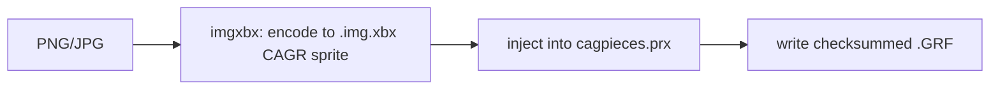

# Codecs & byte-perfection

THUG2 loads its front-end and scripts from packed archives, and the engine is unforgiving:
a few wrong bytes in the wrong file black-screen the boot. Every codec in `thugkit` is
therefore built to **round-trip byte-identically**, and the byte-critical one is fuzzed. This
is the rule the whole project turns on: **byte-perfection = boot safety**.

## PRE / `.prx` archives (`prx/prx.go`)

The game ignores loose level files and reads from `.prx` (PRE) archives under `Data/pre`.
The format:

```
Header:  "PRE\0"  +  <u32 fileCount>
Per file:
  <u32 dataSize>     uncompressed size
  <u32 compSize>     compressed size (== dataSize when stored raw)
  <u32 nameLen>
  <u32 nameCRC>      name checksum, preserved as-is
  name bytes
  data bytes         (4-byte aligned)
```

The `prx` package exposes `Parse` / `Build`, `Find` / `FindBySuffix`, `ReplaceRaw`, and
`ReplaceCompressed`. It preserves the name CRC verbatim and honours the 4-byte alignment, so
`Build(Parse(x)) == x` for real game archives. That round-trip guarantee is what lets the mod
apply rewrite one entry inside a `.prx` without disturbing the rest.

## LZSS compression (`prx/lzss.go`)

Entries can be stored raw or LZSS-compressed. `qb_scripts.prx` is **always** injected
compressed because of the boot ceiling (below). LZSS is the one codec where a subtle encoder
bug could produce output the game decompresses wrong, so it is the fuzz target:

```sh
go test ./prx -run x -fuzz FuzzLZSS
```

See [Testing](testing.md).

## NeverScript `.qb` (compiler fork)

Game scripts are compiled binary `.qb` (QB) files. Mods are authored as human-readable `.ns`
NeverScript and compiled to `.qb` by our patched compiler fork (vendored into thugkit as a
submodule). The fork is a **byte-perfect recompiler**: it round-trips the vast majority of the
game's script files identically, which is what makes injecting a modified script safe. The
`apply` step compiles `.ns` → `.qb` in-process (no external toolchain at build time). Known
compiler limitations are tracked in the fork's `LIMITATIONS.md`.

## `.GRF` / CAGR tags (`tag/`, `grf/`, `imgxbx/`)

The Create-A-Graphic custom-tag path turns an image into an in-game spray tag:



- `imgxbx/` encodes the image to an Xbox-format `.img.xbx` CAGR sprite.
- `grf/` reads and writes the `.GRF` container byte-exactly, including its checksum.
- `tag/` is the orchestrator (`thugkit tag <image> [--install]`), a Go port of the reference
  Python tag importer that produces byte-identical output.

## The boot ceiling

`qb_scripts.prx` has a hard size limit once compressed:

```go
// build/soundtrack.go
const qbScriptsCeiling = 1499136 // ~1.43 MiB
```

If the compressed `qb_scripts.prx` exceeds this, the boot black-screens. The build verifies
against the ceiling and fails with `"exceeds boot ceiling"` rather than shipping an unbootable
edition. Practical consequence for mod authors: `qb_scripts` changes must fit under the
ceiling **after** LZSS compression, and `keyboard.qb` in particular cannot be modified at all
(any change, even two bytes, black-screens the boot; this has been exhaustively ruled out on
size, compression, offsets, and content). Other `qb_scripts` entries mod fine.

## The discipline in one line

Anything shipped is a compiled, zero-runtime-dependency Go binary; the byte-critical codecs
round-trip and are fuzzed; and you **always boot-test** after touching any front-end or
boot-pack file. When in doubt, verify the round-trip before trusting the change.
