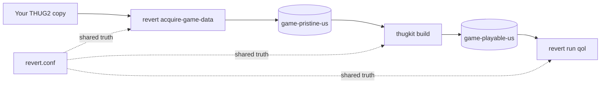

# Revert: developer docs

Revert is the toolkit that builds **THUG2: Violet Vandal Edition**, a preserved,
modernized, stream-safe build of *Tony Hawk's Underground 2* (PC). One front door
installs it, three lanes play it (Vanilla, QOL-Modded, Online), and everything is
reproducible from your own copy of the game.

These docs are for the engineer who wants to understand how that works and contribute.
If you just want to install and play, use the [player install guides](https://thug2vandal.com/install)
instead.

!!! info "Bring your own disc"
    Revert ships tooling only, never game data. Every build input that is game data or
    licensed is user-supplied and gitignored: the pristine base, the no-CD exe, the
    WidescreenFix, the HQ audio/video pack, and the branded-deck / guest-model blobs. The
    repos hold the orchestrator, the engine, the mod sources, config, and docs.

## The shape of the system

Revert is a hybrid of two planes that talk only through a CLI:

- **`thugkit` (Go)** is the deterministic build engine. It takes already-extracted game
  directories and produces the playable edition: mirrors the pristine base, applies the
  no-CD exe and WidescreenFix, compiles and injects the mods, installs custom tags and the
  HUD/glyph `.asi`s, overlays HQ audio/video, and optionally bakes a soundtrack. It has
  **no `os/exec`**, so it stays a single static, cross-compilable binary.
- **`revert` (bash)** is the thin orchestrator. It owns system setup (Wine, DXVK,
  controller), acquiring your game copy, launching the three lanes under GE-Proton, and the
  optional Python CAS asset passes. It shells out to `thugkit` for the build.



`revert.conf` is the single source of truth for both planes: paths, the Wine runtime, and
the per-lane / per-edition variables.

## Repo topology

The monorepo root **is** the `violetvandal/revert` toolkit repo (bash orchestrator + config
+ shippable non-game assets + these docs). Independent git repos live under it, gitignored
by the root:

| Repo | Language | What it is |
|------|----------|------------|
| `tools/thugkit` | Go | The mod-apply + build engine. Self-contained via a submodule of the NeverScript fork. |
| `tools/neverscript` | Rust/… | Our patched NeverScript compiler fork (byte-perfect `.qb` recompiler). |
| `mods` | NeverScript | The quality-of-life mod layer: `.ns` sources + apply metadata. No game data. |
| `thug2-tag-importer` | Python | Reference image → Create-A-Graphic tag importer (also ported to Go in thugkit). |
| `thug2-skater-extractor` | Python | Renders a created skater from a `.SKA` save. |

The one hard seam: the root repo and `thugkit` are **separate git repos** and communicate
**only** through the built `thugkit` binary's CLI, never a Go import. See
[Architecture](architecture.md) for why.

## Build from source

```sh
# 1. Clone with submodules (thugkit vendors the NeverScript compiler as a submodule)
git clone --recursive https://github.com/violetvandal/revert.git
cd revert

# 2. Build + test the engine
cd tools/thugkit
go build ./cmd/thugkit
go test ./...          # hermetic: needs no game data

# 3. Build the edition (from the repo root; needs your acquired game data)
cd ../..
./revert doctor        # what's present, what's missing
./revert build         # thugkit build core + Python CAS post-pass
./revert run qol       # play: vanilla | qol | online
```

`revert build` rebuilds the `thugkit` binary from source if a Go toolchain is present;
a shipped Revert carries a prebuilt binary. `revert build --fast` skips the full base mirror
and the HQ A/V overlay for a quick mod-only iteration.

## Where to next

- [Architecture](architecture.md): the three planes, the `.asi` mods, and the cross-repo seam.
- [Build pipeline](build-pipeline.md): a step-by-step trace of `./revert build`.
- [Codecs & byte-perfection](codecs.md): the `.prx`/LZSS/`.qb`/`.GRF` formats and the boot ceiling.
- [Testing](testing.md): unit tests, the LZSS fuzzer, and the parity harnesses.
- [Authoring mods](modding.md): the `ns-inject` model.
- [Platform lanes](platform-lanes.md): how lanes are defined and how to add one.
- [Contributing](contributing.md): conventions, the two-repo flow, and the privacy rules.
