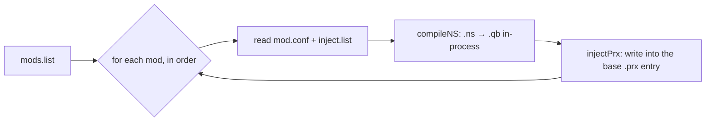

# Authoring mods

The quality-of-life mod layer is the `mods` repo: pure NeverScript sources and apply metadata,
zero game data. This page covers the model and how to add a mod. It describes structure only,
not the derivative script sources themselves.

!!! warning "No game data, no derivative sources here"
    The `mods` repo contains `.ns` that are decompiled-and-modified THUG2 scripts plus some
    licensed binary blobs. It is private and not for wholesale publishing. These docs stay at
    the level of the format and the pipeline. See [Contributing](contributing.md) for the
    publishing rules.

## The `ns-inject` model

A mod is a directory that compiles one or more `.ns` NeverScript files to `.qb` and injects
them into a named entry inside one of the base `.prx` archives. The apply core reads three
kinds of file:

```
mods/
├── mods.list                 # ordered list of mods to apply
└── <mod-name>/
    ├── mod.conf              # type=ns-inject, layer=<n>
    ├── inject.list          # <archive>  <internal-name>  <source.ns>
    └── src/<source>.ns       # the NeverScript source(s)
```

- **`mods.list`** names the mods to apply, in order. Order matters when two mods touch the
  same entry; later layers win.
- **`mod.conf`** declares the mod type (`ns-inject`) and its `layer`.
- **`inject.list`** maps each build: which base archive, which internal entry name, and which
  `.ns` source compiles into it.

## How apply works (`apply/apply.go`)



1. Read `mods.list` in order.
2. For each mod, read its `mod.conf` and `inject.list`.
3. `compileNS` compiles each `.ns` to `.qb` **in-process** using the vendored NeverScript
   compiler (no external toolchain at build time).
4. `injectPrx` writes the compiled `.qb` into the user's own base `.prx`: raw for most
   entries, **LZSS-compressed for the size-capped `qb_scripts`** (see the boot ceiling in
   [Codecs](codecs.md)).

Because injection targets the user's own base archives, the build reproduces from any region's
base. See the [build pipeline](build-pipeline.md) for where apply sits in the whole build.

## Adding a mod

1. Create `mods/<mod-name>/` with a `mod.conf` (`type=ns-inject`, a `layer`) and an
   `inject.list` mapping each `<archive> <internal-name> <source.ns>`.
2. Write the `.ns` under `src/`.
3. Add `<mod-name>` to `mods.list` at the right position (mind the layer ordering).
4. Build and **boot-test**: `./revert build --fast --only <mod-name>` iterates quickly, but a
   full boot is the only proof of safety. If you touched `qb_scripts`, confirm it stays under
   the boot ceiling after compression.
5. Keep the compiled output round-tripping; if the compiler cannot round-trip your target
   script, that is a compiler limitation to fix first, not something to force.

## In-game surfaces

Mods that expose toggles hook the engine's own flag system, surfacing under the in-game
**LEVEL MODS** (pause) and **MOD OPTIONS** (Game Options) menus, persisted through GlobalFlags.
That is how features like disable-traffic, skip-goal, keep-soundtrack, and the button-glyph
switch persist without a save-file of our own.
